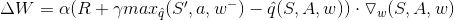
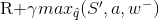
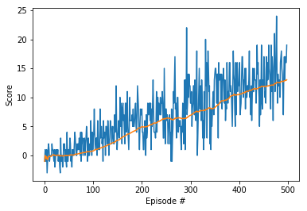
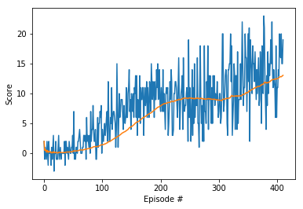
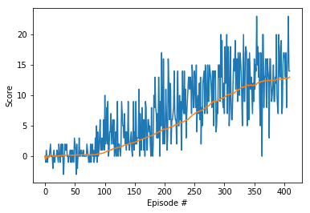
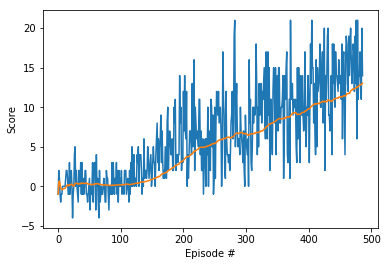
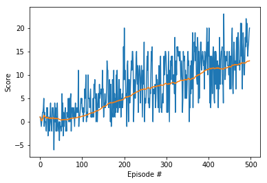
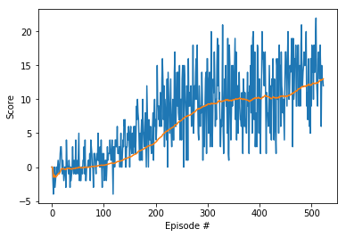
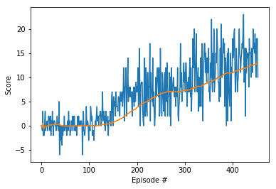

### Deep Q-Networks Applied to Navigation

My purpose here was to investigate the affect of epsilon on the speed that the agent learns to solve the given task. This is just a vanilla DQN. To train an agent to be the best it could be would take much longer, and would benefit from double and dueling DQN modifications as well as prioritized experienced replay.

It's certainly useful to have a very small epsilon if the agent is undergoing a significant training period, but even for relatively short training periods an epsilon that decays very quickly can be detrimental. Typically, there needs to be a wide degree of exploration for the agent to operate well. However, if the agent gets lucky early with its actions, a lower epsilon would encourage the agent to continue on with these rewarding actions, allowing the quick completion of the given task. 

DQN is an off-policy algorithm, meaning the actions it takes aren't necessarily the actions that the algorithm estimates to be optimal. Take not of how we update a weight vector W:

with

as the temporal difference target. We freeze the weights for some time and take the action for a given state that returns the estimated maximum value under those frozen weights as our baseline, without actually taking that action necessarily. This makes the algorithm more exploratory at the cost of stability in online training performance.

Epsilon is the hyperperameter that controls the exploration of the algorithm. It is set as a decimal number very close to one, and multiples itself by itself in order to decay over time.  A high epsilon means that the algorithm is very unlikely to take the optimal action for a given state. Thus, the algorithm starts off very exploratory and over time starts taking the actions that it found to return the highest discounted reward.

